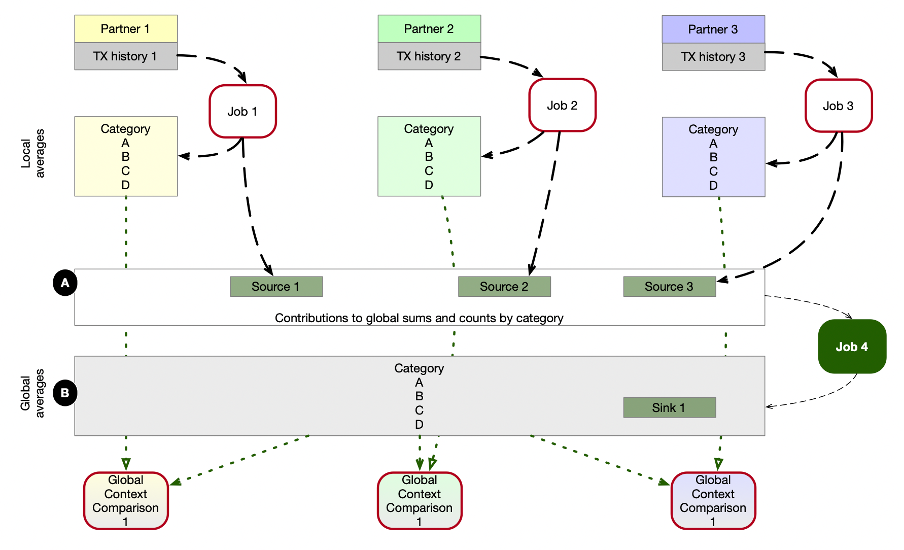

The third part of this article series is an activity log. 
Motivated by the learnings from last time, I stated implementing a Kafka Source component and a Kafka Sink component for the Apache Spark platform in Apache Wayang.
In our previous article we shared the results of the work on the frist Apache Kafka integration using the Java Platform. 

Let's see how it goes this time with Apache Spark.

## The goal of this implementation

We want to process data from Apache Kafka topics, which are hosted on Confluent cloud.
In our example scenario, the data is available in multiple different clusters, in different regions and owned by different organizations.

We assume, that the operator of our job has been granted appropriate permissions, and the topic owner already provided the configuration properties, including access coordinates and credentials.



This illustration has already been introduced in part one. 
We focus on **Job 4** in the image and start to implement it. 
This time we expect the processing load to be higher so that we want to utilize the scalability capabilities of Apache Spark. 

Again, we start with a **WayangContext**, as shown by examples in the Wayang code repository.

```
WayangContext wayangContext = new WayangContext().with(Spark.basicPlugin());
```
We simply switched the backend system towards Apache Spark by using the _WayangContext_ with _Spark.basicPlugin()_.
The **JavaPlanBuilder** and all other logic of our example job won't be touched.

In order to make this working we will now implement the Mappings and the Operators for the Apache Spark platform module.

## Implementation of Input- and Output Operators

We reuse the Kafka Source and Kafka Sink components which have been created for the JavaKafkaSource and JavaKafkaSink.
Hence we work with Wayang's Java API.

**Level 1 – Wayang execution plan with abstract operators**

Since the _JavaPlanBuilder_ already exposes the function for selecting a Kafka topic as source
and the _DataQuantaBuilder_ class exposes the _writeKafkaTopic_ function we can move on quickly. 

Remember, in this API layer we use the Scala programming language, but we utilize the Java classes, implemented in the layer below.

**Level 2 – Wiring between Platform Abstraction and Implementation**

As in the case with the Java Platform, in the second layer we build a bridge between the WayangContext and the PlanBuilders, which work together with DataQuanta and the DataQuantaBuilder.

We must provide the mapping between the abstract components and the specific implementations in this layer.

Therefore, the mappings package in project **wayang-platforms/wayang-spark** has a class _Mappings_ in which 
our _KafkaTopicSinkMapping_ and _KafkaTopicSourceMapping_ will be registered.

Again, these classes allow the Apache Wayang framework to use the Java implementation of the KafkaTopicSource component (and KafkaTopicSink respectively). 

While the Wayang execution plan uses the higher abstractions, here on the “platform level” we have to link the specific implementation for the target platform. 
In this case this leads to an Apache Spark job, running on a Spark cluster which is set up by the Apache Wayang framework using the logical components of the execution plan, and the Apache Spark configuration provided at runtime.

A mapping links an operator implementation to the abstraction used in an execution plan. 
We define two new mappings for our purpose, namely KafkaTopicSourceMapping, and KafkaTopicSinkMapping, both could be reused from last round.

For the Spark platform we simply replace the occurences of _JavaPlatform_ with _SparkPlatform_.

Furthermore, we create an implementation of the _SparkKafkaTopicSource_ and _SparkKafkaTopicSink_.

**Layer 3 – Input/Output Connector Layer**

Let's quickly recap, how does Apache Spark interacts with Apache Kafka? 

There is already an integration which gives us a DataSet using the Spark SQL framework. 
For Spark Streaming, there is also a Kafka integration using the _SparkSession_'s _readStream()_ function.
Kafka client properties are provided as key value pairs _k_ and _v_ by using the _option( k, v )_ function.
For writing into a topic, we can use the _writeStream()_ function.
But from a first look, it seems to be not the best fit. 

Another approach is possible. 
We can use simple RDDs to process data previously consumed from Apache Kafka.
This is a more low-level approach compared to using Datasets with Spark Structured Streaming, 
and it typically involves using the Kafka RDD API provided by Spark. 

This approach is less common with newer versions of Spark, as Structured Streaming provides a higher-level abstraction that simplifies stream processing. 
However, we might need that approach for the integration with Apache Wayang. 

For now, we will focus on the lower level approach and plan to consume data from Kafka using a Kafka client, and then
we parallelize the records in an RDD.

This allows us to reuse _KafkaTopicSource_ and _KafkaTopicSink_ classes we built last time. 
Those were made specifically for a simple non parallel Java program, using one Consumer and one Producer.

The selected approach does not yet fully take advantage from Spark's parallelism at load time. 
For higher loads and especially for streaming processing we would have to investigate another approache, using a _SparkStreamingContext_, but this is out of scope for now.

Since we can't reuse the _JavaKafkaTopicSource_ and _JavaKafkaTopicSink_ we rather implement _SparkKafkaTopicSource_ and _SparkKafkaTopicSink_ based on given _SparkTextFileSource_ and _SparkTextFileSink_ which both cary all needed RDD specific logic.

## Summary
As expected, the integration of Apache Spark with Apache Wayang was no magic, thanks to a fluent API design and a well structured architecture of Apache Wayang. 
We could easily follow the pattern we have worked out in the previous exercise.

But a bunch of much more interesting work will follow next. 
More testing, more serialization schemes, and Kafka Schema Registry support should follow, and full parallelization as well.

The code has been submitted to the Apache Wayang repository.


## Outlook
The next part of the article series will cover the real world example as described in image 1.
We will show how analysts and developers can use the Apache Kafka integration for Apache Wayang to solve cross organizational collaboration issues.
Therefore, we will bring all puzzles together, and show the full implementation of the multi organizational data collaboration use case.


